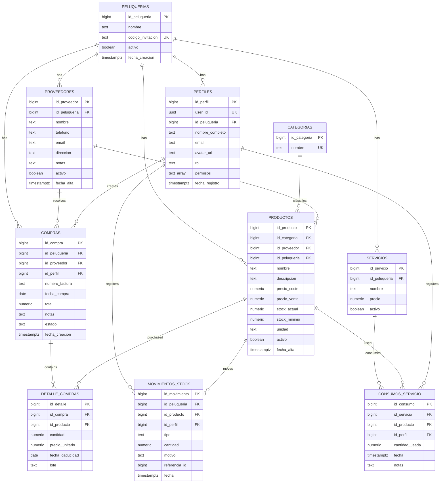

# LookControl database schema

Generated on 2026-05-04 from the local application model and Supabase migrations.

Supabase CLI could not export the real remote dump because the local session does not have a Supabase access token. For the exact remote schema, run:

```powershell
npx supabase login
npx supabase db dump --linked -f supabase\LookControl.sql
```


